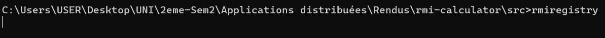
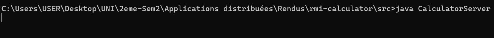
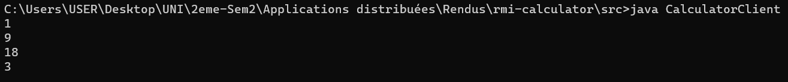

# Exemple Calculator JavaRmi 
### rmiregistry

> Lancer le gestionnaire de registres qui vient avec Java RMI sur le port 1099 de la machine hote 
> (par defaut) comme un service de Naming.
> - Faire bind des services du serveur
> - Aide le client a trouver l'adresse de l'objet cherché
### Server

> Declancher le serveur comme Daemon pour attendre les requettes des clients sur <b>rmi://localhost:1099/CalculatorService</b>
### Client

> Appel a distance du service Calculator sur <b>rmi://localhost/CalculatorService</b>