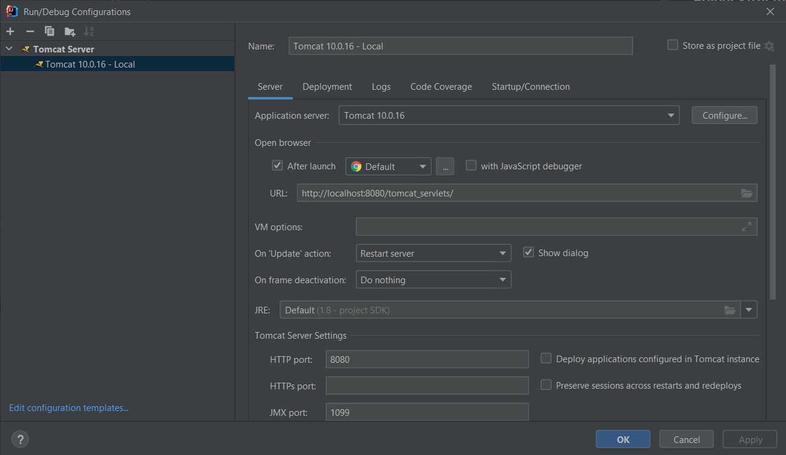
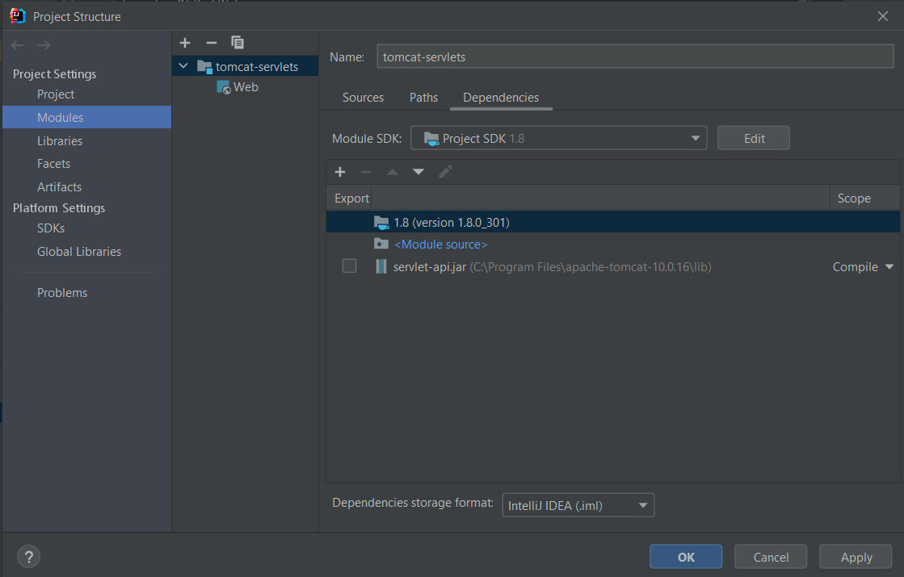
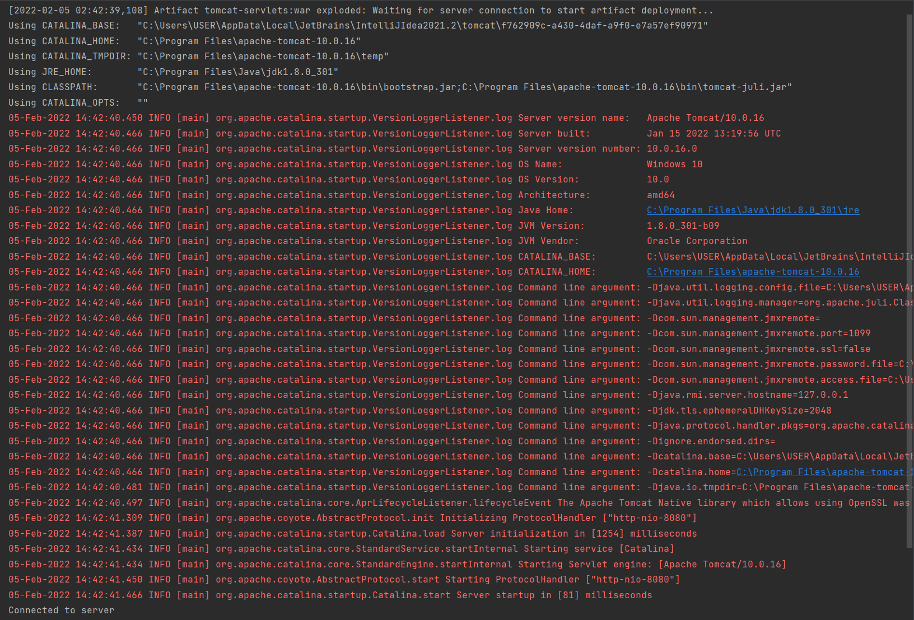
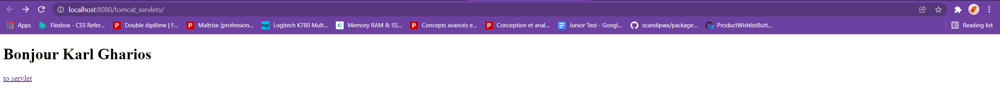
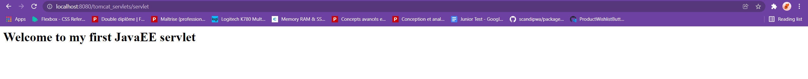

# Java Servlets

## Description

This repository contains a simple Apache Tomcat Servlet Example

## Usage
### Installing

 - Apache Tomcat 10.0.16 [Download Apache Tomcat](https://tomcat.apache.org/download-10.cgi)
 - Intellij IDEA

### Folder structure

```
tomcat-servlets/    # Root directory.
|- src/             # Servlets Directory
|-  |- FirstServlet.java
|- web/             # Webapps Directory
|   |- WEB-INF/
|      |- web.xml
|   |- index.html
```

### Configuring IntelliJ IDEA 
###### Add Tomcat Server

###### Add servlet jar files
- File > Project Structure ...



### Tomcat Localhost Log (IntelliJ IDEA)

### Output
http://localhost:8080/tomcat_servlets/



http://localhost:8080/tomcat_servlets/servlet

